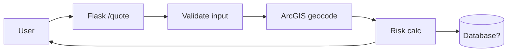

# 01 — Discovery Protocol

> **Phase 1 of the mission.** Complete this before installing any tooling. Output a `discovery_notes.md` at the repo root.

The goal of discovery is to understand **what you are looking at** before you start measuring it. Tooling without context produces noise. Spend time here.

---

## Step 1: Repository Topology

Walk the repository tree and record:

- Top-level layout (folders and their apparent purpose)
- Entry points: which file is run to start the Flask app? (`app.py`, `wsgi.py`, `main.py`, `run.py`?)
- Where Flask routes are defined (single file vs blueprints)
- Where ArcGIS calls happen (concentrated in one module or scattered?)
- Where configuration lives (`.env`, `config.py`, hardcoded constants, environment variables)
- Where dependencies are declared (`requirements.txt`, `pyproject.toml`, `Pipfile`, `setup.py`)
- Presence/absence of: tests, CI config (`.github/workflows`, `.gitlab-ci.yml`), Dockerfile, README, LICENSE, `.gitignore`

Use `find . -type f -name "*.py" | head -50` and `ls -la` style commands. Build a tree using `tree -L 3 -I '__pycache__|*.egg-info|.git|venv|.venv|node_modules'` if available, or `find . -type d -not -path '*/\.*' | head -30`.

## Step 2: ArcGIS Footprint Detection

Determine which ArcGIS libraries are in use. This drives the rest of the analysis.

```bash
# In the repo root:
grep -rn "import arcpy" --include="*.py"
grep -rn "import arcgis" --include="*.py"
grep -rn "from arcpy" --include="*.py"
grep -rn "from arcgis" --include="*.py"
grep -rn "GIS(" --include="*.py"          # arcgis.GIS portal connection
grep -rn "arcpy\." --include="*.py" | wc -l
grep -rn "arcgis\." --include="*.py" | wc -l
```

Record in `discovery_notes.md`:
- Which library/libraries are used
- How many call sites of each (approximate)
- Which submodules: `arcpy.management`, `arcpy.analysis`, `arcgis.features`, `arcgis.gis`, `arcgis.geocoding`, etc.
- Whether the code connects to a portal (`GIS("https://...", user, pass)`) and where credentials come from
- Whether the code reads/writes file geodatabases (`.gdb`), shapefiles, feature services, or hosted layers
- Any obvious geoprocessing operations (buffer, intersect, spatial join, etc.) — these have performance implications

## Step 3: Flask Surface Mapping

```bash
grep -rn "@app.route\|@.*\.route\|add_url_rule" --include="*.py"
grep -rn "request.form\|request.args\|request.json\|request.files" --include="*.py"
grep -rn "session\[" --include="*.py"
grep -rn "render_template\|jsonify\|send_file" --include="*.py"
```

Record:
- Every route (method + path + handler function)
- For each route: what user input does it accept, what does it return, does it require auth
- Use of templates (Jinja2) vs API-only responses
- Session usage and where the secret key comes from
- File upload endpoints (high-risk area)
- Any route that takes user input and passes it to an ArcGIS function (potential injection / SSRF surface)

## Step 4: Data Flow Sketch

Produce a simple textual or Mermaid diagram showing:

```
[User Browser] → [Flask Route] → [Business Logic] → [ArcGIS API/arcpy] → [Portal / GDB / Service]
                                       ↓
                                  [Response]
```

For an insurance application, also identify: where does claims/policy/PII data enter? Where is it persisted? Where does it leave the system (logs, responses, external APIs)?

If you can produce a Mermaid diagram, embed it in `discovery_notes.md`:

````markdown

````

## Step 5: Configuration & Secrets Audit

Before running scanners, do a manual pass:

```bash
grep -rn "password\|passwd\|secret\|token\|api_key\|apikey" --include="*.py" --include="*.cfg" --include="*.ini" --include="*.yml" --include="*.yaml" --include="*.json" --include="*.env*" | grep -v "test_\|#"
```

Record findings as locations only — **do not copy the credential values** into your notes. Use:

> `app/config.py:23` — appears to contain hardcoded ArcGIS portal credential. Requires remediation.

## Step 6: Dependency Surface

```bash
# If requirements.txt exists:
cat requirements.txt

# If pyproject.toml exists:
cat pyproject.toml

# If neither, derive from imports:
grep -rh "^import \|^from " --include="*.py" | sort -u
```

Record:
- Pinned versions vs floating (`==` vs `>=` vs unpinned)
- Presence of `arcpy` listed (it shouldn't be — it's installed with ArcGIS Pro, not pip)
- Presence of `arcgis` (this one IS pip-installable)
- Flask version
- Any obviously old/unmaintained packages

## Step 7: Operational Context (Best-Effort)

You probably won't have full answers, but look for clues:

- Is there a `Dockerfile`? (deployment story)
- Is there a `Procfile`, `gunicorn`/`uwsgi` config? (production server)
- Any references to logging frameworks beyond `print()`?
- Any health check endpoints?
- Any references to a CI/CD system in comments or config?
- Git history depth: `git log --oneline | wc -l` and `git log --format='%an' | sort -u | wc -l` (commits and contributors — tells you how much institutional memory exists in the repo)

Document what you find and explicitly flag what you cannot determine from static inspection. These gaps become entries in the SDLC Audit Report's "Deployment and Operations" section.

## Step 8: Write `discovery_notes.md`

Structure:

```markdown
# Discovery Notes

## 1. Repository Topology
[tree output, entry points, layout summary]

## 2. ArcGIS Footprint
- Libraries in use: [arcpy / arcgis / both]
- Call site counts: [...]
- Portal connections: [...]
- Data formats: [...]

## 3. Flask Surface
| Route | Method | Handler | Inputs | Auth | Notes |
|-------|--------|---------|--------|------|-------|
| /quote | POST | get_quote() | address, coverage | none | calls arcgis.geocode |
[etc.]

## 4. Data Flow
[Mermaid diagram or text description]

## 5. Secrets & Configuration Audit
[locations only, no values]

## 6. Dependencies
[summary]

## 7. Operational Context
[what's known and what's unknown]

## 8. Open Questions
[things you couldn't determine from static analysis — these flow into the SDLC report]
```

Once `discovery_notes.md` exists and is complete, proceed to Phase 2.
