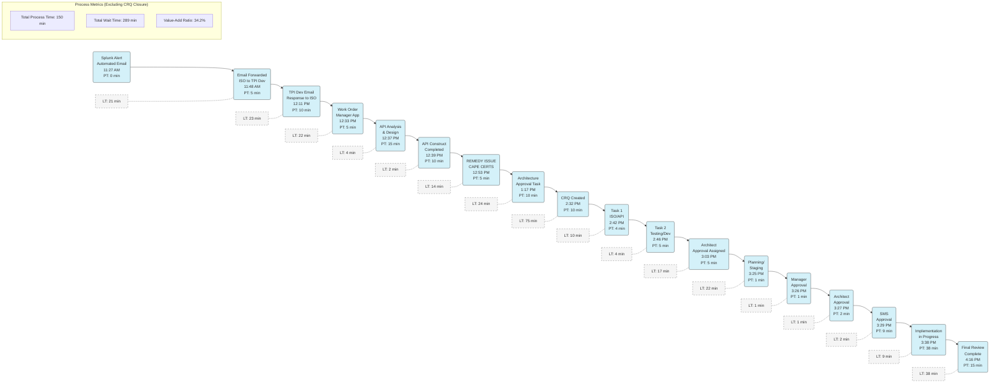

# Cape Certificate Expired Process Value Stream Map

This diagram represents the updated value stream map for the Cape Certificate Expired Process, showing the sequence of activities from Splunk Alert to Final Review completion.

## Value Stream Map Analysis

### Key Process Stages:
1. **Alert & Initial Communication (11:27 AM - 12:33 PM)**
   - Splunk Alert triggers automated email
   - Email forwarding between ISO and TPI Dev teams
   - Work order creation in management app

2. **Technical Analysis & Design (12:37 PM - 12:53 PM)**
   - API analysis, design, and construction
   - Initial remedy issue verification

3. **Approval Process Setup (1:17 PM - 3:03 PM)**
   - Architecture approval task creation
   - CRQ creation
   - Task assignments for ISO/API and Testing/Dev
   - Architect approval assignment

4. **Final Approvals (3:25 PM - 3:29 PM)**
   - Planning/staging transition
   - Manager approval (Eric)
   - Architect approval
   - SMS notification

5. **Implementation & Completion (3:38 PM - 4:16 PM)**
   - Implementation work
   - Final review by development team

### Waiting Time Analysis:
- **Major Wait Times:**
  - Architecture approval to CRQ creation (75 min)
  - Email responses (23 min)
  - Initial alerting to email forwarding (21 min)
  - Architect approval assignment to planning stage (22 min)

- **Efficiency Metrics:**
  - Total Process Time: 150 minutes of actual work
  - Total Wait Time: 289 minutes of non-value-adding time
  - Value-Add Ratio: 34.2% (excluding CRQ closure)

### Improvement Opportunities:
1. **Communication Efficiency:**
   - Reduce the 23-minute wait time between email forwarding and responses
   - Consider direct alert routing to eliminate the 21-minute initial delay

2. **Approval Process Streamlining:**
   - Question the necessity of architecture approval for certificate updates
   - Investigate the 75-minute gap between architecture approval task and CRQ creation

3. **Process Integration:**
   - Consider combining the closely timed approval steps (3:25-3:29 PM) into a single approval workflow
   - Evaluate if the remedy issue step at 12:53 PM could be integrated with API construction

4. **Automation Opportunities:**
   - Automate email forwarding to eliminate the 21-minute initial delay
   - Create automated triggers between work order creation and API analysis to reduce the 4-minute gap

With the CRQ closure step excluded from analysis, the process shows a significantly better value-add ratio of 34.2% compared to the previous 10.2%, indicating that the core technical process is reasonably efficient, while the administrative closure introduces considerable delay.
