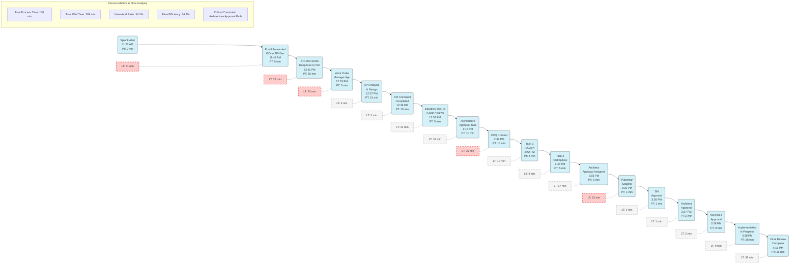

# Cape Certificate Expired Process - Flow Engineering Analysis

## Value Stream Map with Flow Engineering Principles

This analysis applies core concepts from "Flow Engineering" to visualize and optimize the Cape Certificate renewal process, focusing on improving flow efficiency and reducing constraints.

## Flow Engineering Analysis

### 1. Identify Value (Customer Perspective)
In Flow Engineering, value is defined as "the difference in the price that an economically rational buyer would pay for a work product before, and after, the activity is performed." For this certificate renewal process, the primary value is:
- Renewed certificates with minimal service disruption
- Security compliance maintained
- Reduced risk exposure time

### 2. Critical Constraints Analysis
Flow Engineering emphasizes identifying critical constraints to get "at least 20% of time back immediately." Primary constraints in this process:
- Architecture approval path (75 min + 22 min wait times)
- Initial email communication cycles (21 + 23 + 22 min = 66 min wait time)
- Excessive handoffs between teams creating friction points

### 3. Flow Optimization Opportunities
The concept of Flow "strives to achieve the continuous and uninterrupted delivery of value" by removing bottlenecks, minimizing delays, and ensuring seamless movement through the value stream.

Key optimization areas:
1. **Communication Streamlining**: Eliminate the initial email cycles by implementing direct alert routing to work order system
2. **Dependency Reduction**: Question the necessity of architecture approval for routine certificate renewal
3. **Batch Size Reduction**: Process certificates in smaller batches or individually rather than waiting for batch approvals
4. **Parallel Processing**: Enable simultaneous task completion where possible (especially during approval stages)

### 4. Pull System Implementation
A pull system ensures delivering "only what the customer wants, only when they want it" rather than pushing work through the system.

Recommendations:
- Create a dedicated certificate renewal kanban board with WIP limits
- Implement visual cues for approaching certificate expirations (30/15/7 day warnings)
- Establish clear triggers for when to pull work to the next stage
- Automate status notifications to eliminate manual SMS steps

### 5. Flow Metrics & Continuous Improvement
Flow metrics should focus on "safety, quality, speed of delivery, cash flow, productivity, clarity, and morale" rather than just utilization.

Recommended metrics:
- Lead time for certificate renewals (target: <4 hours)
- Percentage of certificates renewed before expiration (target: 100%)
- Number of handoffs in process (target: reduce by 50%)
- First-time approval rate (target: >95%)

## Implementation Roadmap

1. **Immediate Actions** (20% time recovery):
   - Eliminate architecture approval requirement for routine certificate renewals
   - Create direct integration between Splunk alerts and work order system

2. **Near-Term Improvements** (30-40% time recovery):
   - Implement kanban board for certificate management
   - Consolidate approval steps into a single stage
   - Create standard work procedures for each process step

3. **Long-Term Transformation** (>50% time recovery):
   - Automate certificate monitoring and renewal process
   - Implement predictive alerts for upcoming expirations
   - Create self-service portal for standard certificate renewals

This analysis applies Flow Engineering principles to transform the certificate renewal process from a reactive, high-friction workflow to a proactive, streamlined system that maximizes flow efficiency while reducing organizational burden.
