# Realistic VSM Optimization - Proper Time Analysis

## Current State Analysis (Actual Times)

**Converting to consistent units (hours):**

**Process Time:**
- 2 hours + 5 min + 24 hours + 1 hour + multiple small steps ≈ **32 hours** of actual work
- Most individual steps are very fast (5-30 minutes)
- Main work items: Development (24 hours), initial creation (2 hours)

**Wait Time (The Real Problem):**
- **3 × 1-day waits = 72 hours**
- **3 × 2-day waits = 144 hours**  
- Plus smaller waits ≈ **230+ hours of waiting**

**Total Lead Time: ~262 hours (11+ business days)**
**Flow Efficiency: 32/262 = 12%** (Terrible!)

## Root Cause Analysis

The real issues aren't the process steps - they're the **massive wait times**:

1. **Documentation delays** (1 day wait)
2. **Meeting scheduling delays** (1-2 day waits between TCAB, Pre-Release, approvals)
3. **Approval bottlenecks** (2-day waits for SM and CM approvals)
4. **CAB scheduling** (2 days wait)
5. **Deployment scheduling** (1 day wait to configure QB)

## Optimized Future State (Realistic)

```mermaid
graph LR
    S0["Create Backlog Item + Requirements"]
    S0 -->|2 hours| S1
    S1["Development + Code Review"]
    S1 -->|1 day| S2
    S2["Automated CI/CD Pipeline"]
    S2 -->|15 min| S3
    S3["Automated Testing (All Environments)"]
    S3 -->|30 min| S4
    S4["Pre-Approved Standard Change"]
    S4 -->|10 min| S5
    S5["Automated Production Deployment"]
    S5 -->|15 min| S6
    S6["Post-Deployment Validation (15 min)"]

    %% Add wait times - MUCH REDUCED
    S0 -.->|Wait: 2 hours| S1
    S1 -.->|Wait: 1 hour| S2
    S2 -.->|Wait: 5 min| S3
    S3 -.->|Wait: 5 min| S4
    S4 -.->|Wait: 1 hour| S5
    S5 -.->|Wait: 5 min| S6

    %% Add process metrics
    subgraph Metrics
        PT[Process Time: 27 hours]
        LT[Lead Time: 31 hours]
        FE[Flow Efficiency: 87%]
    end

    %% Styling
    classDef development fill:#e0f2fe,stroke:#0277bd,stroke-width:3px
    classDef automation fill:#e8f5e8,stroke:#2e7d32,stroke-width:3px
    classDef governance fill:#fff3e0,stroke:#f57c00,stroke-width:3px
    
    class S0,S1 development
    class S2,S3,S5,S6 automation
    class S4 governance
```

## Key Improvements (Realistic Targets)

### 1. **Attack the Wait Times** (Primary Focus)
- **Eliminate approval delays**: Pre-approved standard changes for low-risk items
- **Consolidate meetings**: Single change review instead of TCAB + Pre-Release + CAB
- **Automated scheduling**: No manual coordination delays
- **Same-day approvals**: For standard changes, approval happens automatically

### 2. **Streamline Process Steps**
- **Combine environments**: Automated testing across all environments in pipeline
- **Automated documentation**: Updates happen during deployment
- **Parallel activities**: Code review happens during development

### 3. **Realistic Metrics Improvement**

| Metric | Current (Actual) | Optimized | Improvement |
|--------|------------------|-----------|-------------|
| **Process Time** | 32 hours | 27 hours | -15% |
| **Wait Time** | 230+ hours | 4 hours | -98% |
| **Lead Time** | 262+ hours | 31 hours | -88% |
| **Flow Efficiency** | 12% | 87% | +75% |
| **Delivery Time** | 11+ days | 1.3 days | -88% |

## Implementation Strategy

### Quick Wins (Week 1-2)
1. **Pre-approve standard changes** - eliminates 6+ days of approval waits
2. **Consolidate review meetings** - single 30-min review vs multiple meetings
3. **Automated testing pipeline** - eliminates manual test coordination

### Medium Term (Month 1-2)  
1. **Implement CI/CD pipeline** - automates deployment coordination
2. **Risk-based change management** - fast track for low-risk changes
3. **Automated documentation** - eliminates manual update delays

### Long Term (Month 3+)
1. **Continuous deployment** for approved change types
2. **Advanced monitoring** to reduce validation time
3. **Further automation** of remaining manual steps

## The Real Problem & Solution

**Current**: 88% of your time is spent waiting for approvals and meetings
**Solution**: Attack the wait times, not the work times

Most of your process steps are actually quite efficient (5-30 minutes each). The killer is the 2-day waits between each approval step. By implementing standard change processes and automated approvals for low-risk items, you can eliminate most waiting time while maintaining governance.