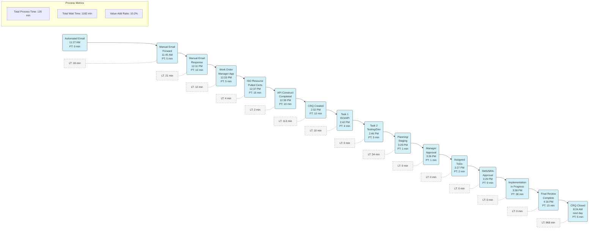

# Cape Certificate Expired Process Value Stream Map

This diagram represents the value stream map for the Cape Certificate Expired Process, showing the sequence of activities with process times and wait times.

## Value Stream Map Analysis

### Key Process Steps:
1. **Initial Notification (11:27 AM - 12:33 PM)**
   - Automated email triggers the process
   - Manual email handling and work order creation

2. **Technical Work (12:37 PM - 12:39 PM)**
   - ISO resource pulls certificates
   - API construction completed

3. **Change Request Processing (2:32 PM - 3:29 PM)**
   - CRQ creation and task assignments
   - Planning, manager approval, and notifications

4. **Implementation & Review (3:38 PM - 4:16 PM)**
   - Implementation work
   - Final review by development team

5. **Closure (8:24 AM next day)**
   - CRQ formally closed

### Waiting Time Analysis:
- **Major Wait Times:**
  - Overnight wait (968 min): Final review to CRQ closure
  - Mid-day gap (113 min): API construction to CRQ creation
  - Email handling delays (21 min): Between email forwards and responses

- **Efficiency Metrics:**
  - Total Process Time: 135 minutes of actual work
  - Total Wait Time: 1182 minutes of non-value-adding time
  - Value-Add Ratio: Only 10.2% of total time adds value

### Improvement Opportunities:
1. Investigate the 113-minute gap between API construction and CRQ creation
2. Evaluate if overnight wait for CRQ closure is necessary or could be expedited
3. Look for automation opportunities in the email notification and forwarding steps
4. Examine continuous flow possibilities for the afternoon implementation phases